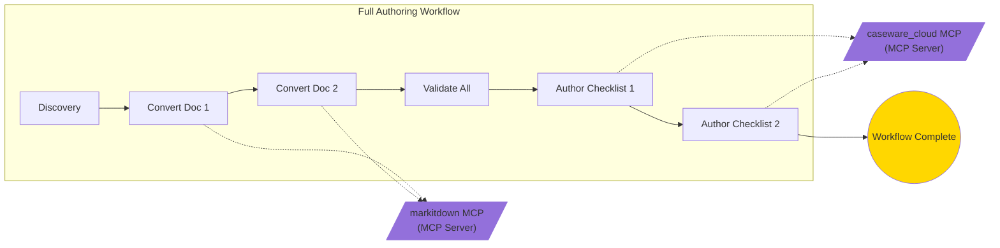

# Visualize Workflow

Generate a Mermaid flowchart visualization from the Knowledge Graph.

**Workflow name:** (provide a workflow entity name, e.g. `AA_W_20260314`)

---

## Prerequisites

- Knowledge Graph tools available (`kg_query`, `kg_export_mermaid`)
- Optional: Figma MCP server for diagram rendering

---

## Steps

**Step 1:** Query the Knowledge Graph for workflow data.

Use `kg_query` with `entity_type: "workflow"` to list all workflows, or with a specific pattern:

```json
{"pattern": "AA_W_*"}
```

To get a specific workflow and its related entities:

```json
{"related_to": "AA_W_20260314"}
```

**Step 2:** Export a Mermaid diagram using `kg_export_mermaid`:

```json
{"root": "AA_W_20260314", "direction": "LR"}
```

**Step 3:** Review and refine the Mermaid output. Apply entity shapes and colors:

| Entity Type | Shape | Color |
|-------------|-------|-------|
| Workflow | Stadium/pill | Blue |
| Task | Rectangle | Green |
| Tool | Rectangle | Purple |
| Document | Document shape | Orange |
| Outcome | Stadium/pill | Gold |

**Step 4:** If Figma MCP is available, generate a Figma diagram with LR direction.

**Step 5:** Present the result with a workflow summary table:

| Metric | Value |
|--------|-------|
| Workflow | Entity name |
| Tasks | Count |
| Tools used | List |
| Documents | Count |
| Outcomes | Count |

---

## Example Output



---

## Notes

- If no workflow name is provided, list all available workflows and let the user choose
- Diagrams exported via Figma are **ephemeral** — they must be manually saved in the Figma interface
- For complex workflows with many entities, consider filtering by relation type (e.g., only `contains` or `uses` relations)
